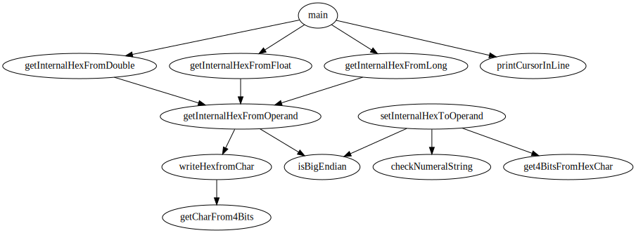

# What's this?

Parse the DOT file(s) that representing call graph and that was generated by Doxygen, marge all callgraph and generate d3.js style object that stores function name array and definitions of function call relation array.

# Requirements

## To gererate DOT files

 - Doxygen
 - Graphviz

## To generate d3.js style object

 - Node.js
 - [anvaka/dotparser](https://github.com/anvaka/dotparser) (Node.js package)

# Usage

## 1. Gererate DOT files

Gererate the DOT file that representing call graph by running Doxygen.  
※Don't forget check following options in Doxygen configuration.

| Option name   | should be set to |
| ------------- | :--------------: |
| `HAVE_DOT`    |      `YES`       |
| `CALL_GRAPH`  |      `YES`       |
| `DOT_CLEANUP` |       `NO`       |

## 2. Generate d3.js style object

Run `dots2d3-callgraph.js`.

### Usage

```
dots2d3-callgraph.js directory [outpath]
```

### Required argment

 - `directory`  
   Directory where DOT file(s) that representing call graph is stored.

### Options

 - `outpath`  
   Path to save the analysis result.
   If not specified, the result will be saved in the directory where DOT file(s) is stored.

# Example

※ This example containing the demonstration of [yakenohara / JavaScript-ForceLayoutMemo ](https://github.com/yakenohara/JavaScript-ForceLayoutMemo).

## 1. Gererate DOT files

### Check out the example C language project

Check out the [yakenohara/DLL-InternalHex](https://github.com/yakenohara/DLL-InternalHex) to the directory where is storing `Doxyfile - 1 DLL-InternalHex` 

↓ Tree diagram of after checking out ↓
```
example
│  Doxyfile - 0 factory default
│  Doxyfile - 1 DLL-InternalHex
│  
└─DLL-InternalHex
    │  .gitignore
    │  Build-Console.sh
--------------Omitting--------------
    │      
    ├─InternalHex
    │  │  CheckNumeralString.c
    │  │  CheckNumeralString.h
    │  │  dllmain.cpp
    │  │  GetInternalHexFromOperand-Console.c
    │  │  GetInternalHexFromOperand.c
--------------Omitting--------------
    └─x64
        └─Debug
                InternalHex_x64.dll
                InternalHex_x64.exp
                InternalHex_x64.ilk
                InternalHex_x64.lib
```

### Generate DOT files by Doxygen

Launch Doxygen and open `Doxyfile - 1 DLL-InternalHex` by `File` -> `Open`.  
※
To know what the differences of this configuration and default configuration,  
check diff `Doxyfile - 0 factory default` and `Doxyfile - 1 DLL-InternalHex`.

Select `Run` Tab -> `Run doxygen`  

↓ Tree diagram of after running ↓
```
example
│  Doxyfile - 0 factory default
│  Doxyfile - 1 DLL-InternalHex
│  
└─DLL-InternalHex
    │  .gitignore
    │  Build-Console.sh
--------------Omitting--------------
│              
└─DLL-InternalHex_dox //<- This was generated by `Run doxygen`
    ├─html
    │  │  bc_s.png
    │  │  bdwn.png
--------------Omitting--------------
    └─latex
--------------Omitting--------------
            _set_internal_hex_to_operand_8h__dep__incl.pdf         
```

## 2. Generate d3.js style object

Pass the `html` directory that Doxygen generated to `dots2d3-callgraph.js` as an argument.

↓ Command prompt as following ↓  
```
D:\dots2d3>node dots2d3-callgraph.js ".\example\DLL-InternalHex_dox\html"
[LOG] Checking argument(s)...
[LOG] INPUT  : "D:\dots2d3\example\DLL-InternalHex_dox\html"
[LOG] OUTPUT : "D:\dots2d3\example\DLL-InternalHex_dox\html\callgraph_all.json"

[LOG] Analyzing...
[LOG] "D:\dots2d3\example\DLL-InternalHex_dox\html\_get_internal_hex_from_operand-_console_8c_a0ddf1224851353fc92bfbff6f499fa97_cgraph.dot"
[LOG] "D:\dots2d3\example\DLL-InternalHex_dox\html\_get_internal_hex_from_operand_8c_a35cf081c99c38679e6b86373f91119d8_cgraph.dot"
--------------Omitting--------------

[LOG] done!

[LOG] ----------RESULT-----------
[LOG] NUMBER OF WARNINGS : 0
[LOG] OUTPUT : "D:\dots2d3\example\DLL-InternalHex_dox\html\callgraph_all.json"

D:\dots2d3>
```

By this example, `callgraph_all.json` was generated.  

## 3. Applying generated .json file to D3.js rendering in web browser

D&D this generated file to any modern web browser you like that opens the fllowing page.  

https://yakenohara.github.io/JavaScript-ForceLayoutMemo/  

In this page, all function definitions are rendered as nodes, and all function call relations are rendered as links.  
And you can do many intaractive feautures about all nodes and links.  
If the placement of nodes is difficult to see, right click and select `Replot`, and doxygen (browser version) will replots nodes.  

To get the DOT file of what you seeing diagram, right click and select `Export` -> `Export as DOT (all)`.


And type `dot -Tsvg Nodes.gv -o Nodes.svg` in command prompt, you can get following svg image.


